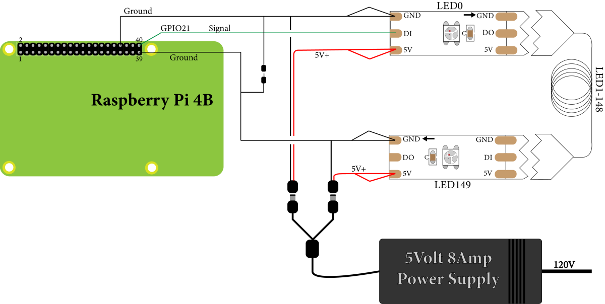
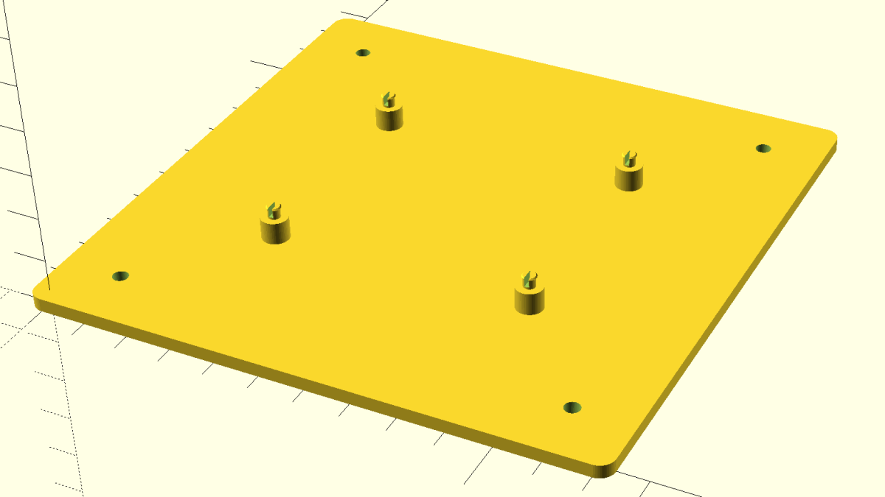
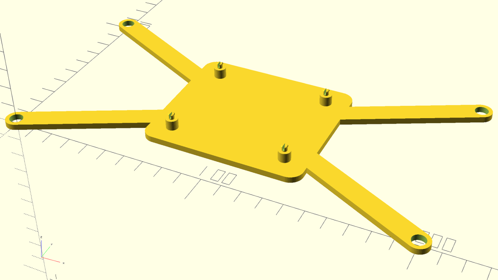
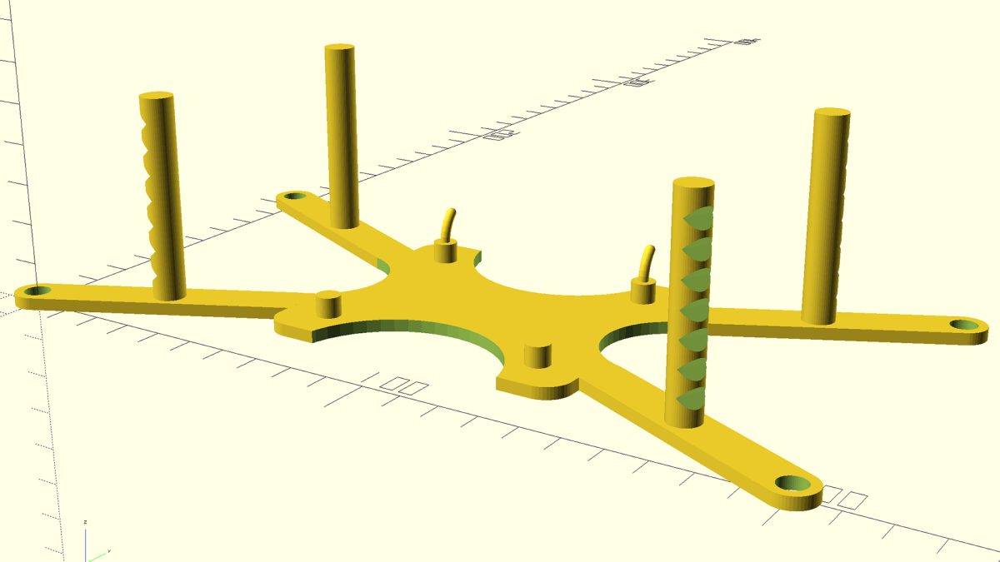
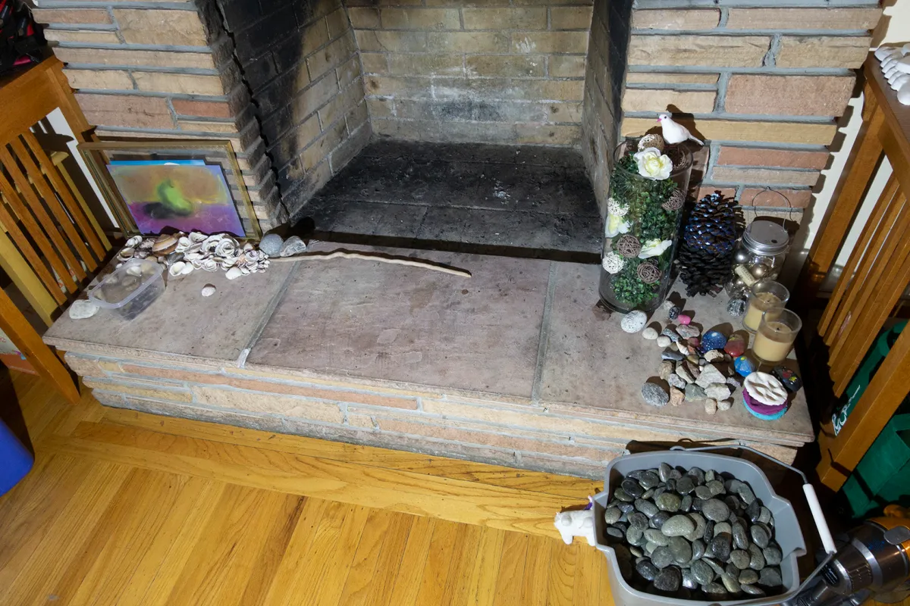
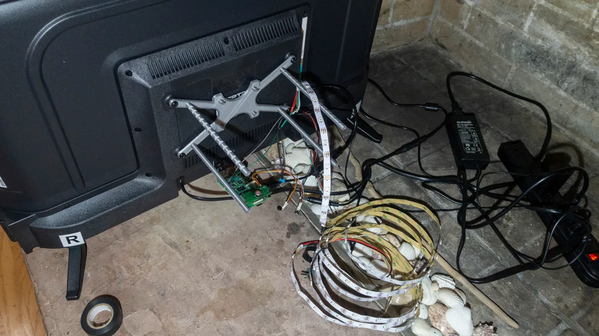
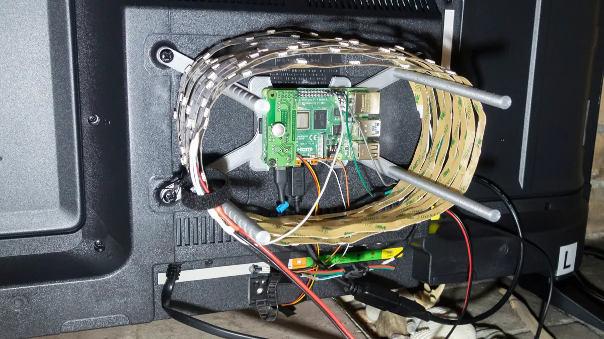
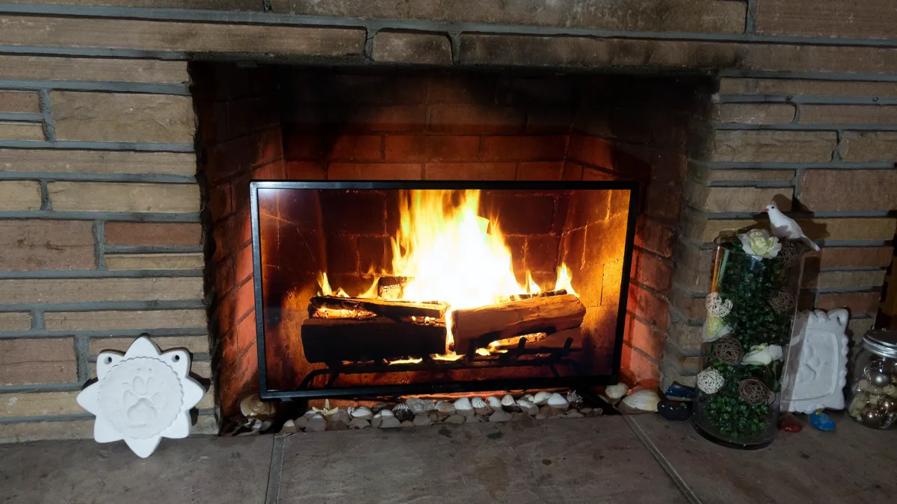

# Fake Fire
Creating a fake fire for the fireplace 2020-01-19

[](https://youtu.be/bWE9JvlVI6A "Fake fire")

Our house has a fireplace, but since it was built a long time ago, we have kids and burning wood in the already polluted valley is probably not a good idea, we don’t use it. The flue is shut and it has some insulation stuffed in and there are some candles in the fire area. However, when the niece and nephew are over or other small ones, even the candles seem like a bad idea. How about a rework with a 32" TV in there with a Raspberry Pi playing a fire video on a loop? Since we have an unused LED strip, maybe some interesting back-lighting. All the code/files will be at the end.

Materials: We started with a 32″ Sceptre 1080p display from Walmart because it was <$120 and was the largest standard size that would still fit. To drive the system, we got a Raspberry Pi 4B with 2G memory. The thinking here is that it would easily play a 1080p video on a loop and drive the LED strip. This part turned out to be overkill and a 3B (or even lower) probably would have worked just fine. Next we got a short HDMI cable and a converter to micro size. We already had a power supply for the Pi and a 150 LED 5M strip, but we needed a 5V 8A power supply for the LEDs which we guessed would probably run at about 4A with some peaks to 5A. For the fire, the easiest thing seemed to be to buy a BluRay disk of a fire and rip it to a file, so I ordered one. Then, how to turn the Pi on and off. There is a tutorial to turn it on/off with an Arduino and IR sensor, but that seems like overkill. The off is not so bad, but I could not find a great way to get it back on in an elegant way. Finally, I went with an [add-on board](https://www.msldigital.com/collections/all-products/products/remotepi-board-for-pi-4-external-ir-and-led) that is built for the purpose. This should allow the same remote that turns on/off the TV to safely turn the Pi on/off as well. The other misc items we had on-hand, like: M6 screws, jumper wires, a keyboard and mouse during setup, etc. Total for everything is probably around $250.

Setting up the Pi: I mostly followed [this video](https://www.youtube.com/watch?v=8grooZWbH9Y) to do the setup. This part was pretty smooth. I only had my 4K monitor at the time and the Pi 4 had no problem driving that. Easy. Also in the easy category, use MakeMKV to pull the video from the Blu-ray disk and handbrake to encode to M4V, even though VLC will read the file produced by MakeMKV. More easy, the SD card I had on-hand was 32GB so plenty of room for the video file and I could turn on ssh and use Putty’s psftp to put the file on the system. I made an error thinking the ftp timeout notice was some kind of error and was assuming bad handling of >2GB files, but after I checked, it was fine.

The next step was to have the file play on boot, full screen and keep looping. The way I found to do this was with a .desktop file. This [RaspberryPi forum post](https://www.raspberrypi.org/forums/viewtopic.php?t=17051) has a very nice description of how to do it. This method was reused to get the LED strip in back to light-up on boot as well. The [VLC command line help page](https://wiki.videolan.org/VLC_command-line_help) fills in the last bits for full screen and looping. The main issue discovered here was that the audio only seems to work via HDMI if you use HDMI0 and not HDMI1. There is probably a way to fix this, but I just plugged into HDMI0 and it worked without doing anything else.

The somewhat harder part was getting the LEDs to work. I wanted to wire them up the third way [shown here](https://learn.adafruit.com/neopixels-on-raspberry-pi/raspberry-pi-wiring), directly with no fanciness. And this works, but not if you put a 330k resistor on the data line like you would with an Arduino. I had just learned to do this with the Arduino to smooth out erratic behavior of the LED strips. You don’t need this with the Pi and since it is pushing about 3.5v instead of the Arduino’s 5V, you will lose the signal to the LED strip and it will do nothing. I assumed it was a setting, so proceeded to switch on several things from the CircuitPython instructions, and considered disabling the audio (some web page said you could not have audio and another PWM going), but removing the resistor worked fine. So after a bit of frustration and trying another strip light leftover, there was light. Shortly after that, I had a script that would light up lights randomly in black (off), red, yellow and orange every tenth of a second. This did not work quite right and would instead spiral through the lights that were still on the spool. Turns out that you need to use the auto_write=False switch when defining your light strip or it will work on that individual light immediately and that will take about a hundredth of a second. That was leading to the spiraling behavior and it worked as intended after setting that switch. It seemed a bit bright, so I added another black and half settings of red, yellow and orange to the selection set. This seemed reasonable for a first try, so I created another .desktop file to turn the lights on at boot. To connect everything with the LEDs:

* The 5V power ended in a barrel jack and I had a splitter to make that two of them.
* The spool already had a data wire on each end. The data wire on the in side (there is an “in” side) went to a jumper which connected to GPIO pin 21, which is physical pin 40. Most instructions say to use 18, but my add-on board will be on that side and I wanted to stay away from it. You don’t need to do anything with the data out side in this case.
* The spool already had two sets of positive and negative power wires on each end. I used both sets on each end and connected each end to its own female barrel jack. I then added a detachable ground connection between the ends and a female jumper ground to each end.
* The barrel jacks went to power on each end.
* The jumper grounds went to two Pi ground pins (two ground connections to the Pi is probably overkill.)

This allowed me to separate the ends so I could un-spool the light strip later and re-spool it on to a holder behind the TV. This was the wiring layout:


That is a good segue to the holder for the Pi and lights behind the TV. The first draft of this was just to size the mount holes for both the TV (using the rear TV mount holes meant to hang it on the wall) and the Pi, using clips to go through the mounting holes for the Pi. I skipped a way to hold the LED strip in place at this point and it ended up looking like this:

There were a couple things wrong here, the mount holes were too small as this turned out to be M6 screw hole size and not pass through size. Also, the TV I was looking at when I did this was 100x100mm mount holes, but the one I got was 200×100 mount holes. Last, the tabs were very small and fragile and one side of one broke right away when test mounting the Pi. So with the next round I tried to fix the mount holes and size and save a little material. It looked like this:

There were a couple problems with this too. It still did not have a way to hold the LED strip in place, the clips were still breaking and the Pi mount part was a bit off center. So on to version three:



This version is pretty close. The hooks to hold the Pi work and are not breaking, we save a bit more plastic with some cut-outs and we have someplace to wrap the LED strip. However, the columns to wrap around turn out to be too small, so those get tripled in the final version.

The last thing to do was to install the hat (add-on board) to nicely power up and shutdown the Pi with remote control. The provided instructions were easy to follow and allowed me to program a remote button of my choice. I was considering the TV power for both but was worried they might get out of sync and then be trouble to get back in sync. The TV remote had some unused buttons at the bottom and I used one of those, which worked fine. In the end, two remote button clicks has everything started in about 15 seconds. Two more has the screen off in two seconds and everything down 10 seconds later. With everything running, it takes about 36 watts of power and with everything low (TV sleep, LED strip black, Pi off and Pi hat waiting for remote signal) it takes 1.6 watts. A few more images:





## Ideas for Next Time
The Raspberry Pi 4 was too much computer for this task. I might consider an OrangePi Zero Plus 2 if I did it again or even something lower power. Buying a disk for the fire was quick and easy, but given more time or less budget, I could have made that video or looked deeper into creating some [simulated fire with Blender](https://www.youtube.com/watch?v=ctd_09qHacA). Also, solutions where a smart TV plays the fire video and a Arduino or other inexpensive solution to drive the lights could have also been investigated. With a little lower power for the device, like the OrangePi Zero, we might have been able to use the USB plug on the TV to both power the device and turn it on/off with CEC signals or from HDMI with MHL.

Zip file with OpenSCAD files, Python code and desktop files [here](fake_fireplace_code.zip).

UPDATE (2021-11-13): I needed to rebuild this as I updated raspbian and it bricked the system. First, after working, don’t update. Just turn off wifi and bluetooth and everything will be fine. Second, I didn’t document a couple things that I needed. I needed to config the audio to default to the HDMI connection, which can be done from ‘sudo raspi-config’ under system settings. Then, I needed two Python packages:

```
sudo pip3 install adafruit-circuitpython-neopixel
sudo pip3 install adafruit-blinka
```

Finally, the hat I bought closed up shop, so I am going to put the final instructions needed to complete the setup to work for shutdown here. SSH into the pi and enter the following:

```
cd /etc
sudo nano rc.local
```

Copy and paste (use shift+ins to paste in nano) the following into the nano editor window, just above the last line (before the line exit 0)

```
(/etc/irswitch.sh)&
```

Then we need to create the file that was just referred to:

```
sudo nano irswitch.sh
```

Enter the following into the file and save it:

```
#!/bin/bash
# this is the GPIO pin receiving the shut-down signal
GPIOpin1=14
echo "$GPIOpin1" > /sys/class/gpio/export
echo "in" > /sys/class/gpio/gpio$GPIOpin1/direction
while true; do
  sleep 1
  power=$(cat /sys/class/gpio/gpio$GPIOpin1/value)
  if [ $power != 0 ]; then
    echo "out" > /sys/class/gpio/gpio$GPIOpin1/direction
    echo "1" > /sys/class/gpio/gpio$GPIOpin1/value
    sleep 3
    sudo shutdown -h now
  fi
done
```

Then make the file executable with:

```
sudo chmod +x irswitch.sh
```

That takes care of shutting down the pi if the remote is triggered, but still need to add cutting the power if it is shut down from the desktop menu. Run:

```
sudo nano /etc/shutdown.sh
```

And paste in the following code:

```
#!/bin/bash
REBOOT_GREP=$(systemctl list-units --type=target | grep reboot)
SHUTDOWN_GREP=$(systemctl list-units --type=target | grep shutdown)
if [ "$SHUTDOWN_GREP" ] && [ ! "$REBOOT_GREP" ]; then
  # the condition above makes sure, that the shutdown sequence is not run on reboot 
  GPIOpin=15
  GPIOpin1=14
  echo "$GPIOpin" > /sys/class/gpio/export
  echo "out" > /sys/class/gpio/gpio$GPIOpin/direction
  echo "1" > /sys/class/gpio/gpio$GPIOpin/value
  sleep 0.125
  echo "0" > /sys/class/gpio/gpio$GPIOpin/value
  sleep 0.2
  echo "1" > /sys/class/gpio/gpio$GPIOpin/value
  sleep 0.4
  echo "0" > /sys/class/gpio/gpio$GPIOpin/value
  echo "$GPIOpin1" > /sys/class/gpio/export
  echo "out" > /sys/class/gpio/gpio$GPIOpin1/direction
  echo "1" > /sys/class/gpio/gpio$GPIOpin1/value
  sleep 4
fi
```

Again, need to make it executable:

```
sudo chmod +x /etc/shutdown.sh
```

Make a service file for the switch:

```
sudo nano /etc/systemd/system/irswitch2.service
```

Then add in the following:

```
[Unit]
Description=RemotePi Board Shutdown Service
Before=multi-user.target
Conflicts=shutdown.target
[Service]
ExecStart=/bin/true
ExecStop=/etc/shutdown.sh
Type=oneshot
RemainAfterExit=yes
[Install]
WantedBy=multi-user.target
```

Then add in the service:
```
sudo systemctl enable irswitch2.service
```

Then reboot to get everything to take effect.
